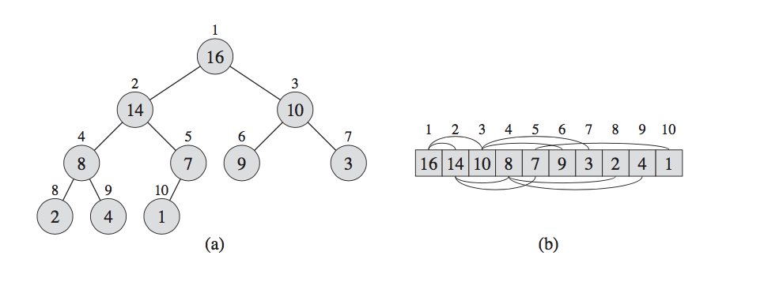

markdown
# Rotfaste trestrukturer 
## Binære heap - Kap. 6 Heapsort
Den binære heap datastrukturen er en liste som vi kan se på som et nesten komplett binærtre. Hver node i treet korresponderer til et element i listen. Treet er helt fylt i alle nivåer, med (mulig) unntak av det laveste nivået, som er fylt fra venstre mot høyre. 

En binær heap er et komplett binnært tre, med noen ekstre egenskaper, kjent som heap egenskaper. Det finnes to forskjellige varianter av heaps; *max-heap* og *min-heap*. Egenskapene til heapen kommer an på hvilken type det er, og er videre forklart under. 

Roten til treet er A[0]. Gitt en index til en node, kan vi lett finne indeksen til dets forgjenger (parent), venstre og høyre barn.


*MAX-HEAP*

### Finne parent, left og rigth child til en node i 

```java
parent(i){                          //Finner index til parent av i
    int parentIndex = ⌊i/2⌋;
}

leftChild(i){                       //Finner index til venstre barn av i
    int leftChildindex = 2*i;
}

rigthChild(i){                      //Finner index til høyre barn av i 
    int rigthChildIndex = 2*i+1;
}
```

### To typer heaps
Det finnes to typer binære heaps. I begge typene tilfredstiller verdiene i nodene en heap-egenskap, som avhenger av typen heap:

* **Max-heap egenskapen**:
    * For hver node *i* &ne; 0 er `A[parent(i)] ≥  A[i]`
      * Altså er veriden til  parent alltid høyere enn til barnet 
    * En nodes verdi er på det meste sin forgjengers verdi - dvs største element ligger i roten.
* **Min-heaps egenskapen**:
  * For hver node *i* &ne; 0 `A[parent(i)] ≤ A[i]` 
    * Altså er verdien til parent alltid lavere enn til barnet 
  * En nodes verdi er på det misnte sin forgjenger verdi - dvs. minste element ligger i roten 


Dersom vi ser på en heap som et tre, definerer vi høyden til en node i treet til den lengste enkle veien fra noden til en løvnode, og vi definerer *høyden* til treet til å være høyden til roten.

> Siden en heap av n elementer er basert på et komplett binært tre, er dens høyde θ(log n), som vi ser igjen på tradisjonelle heap-prosedyrer 

## Heap operasjoner 
### MAX_HEAPIFY(A, i)
Er en veldig vanlig operasjon på en allerede eksisterende heap. Den omorganiserer en heap slik at den opprettholder sine egenskaper. 

```java
MAX-HEAPIFY(A,i)
1   l = left(i)                  //Left child
2   r = right(i)                //Right child
3   if l ≤ A.heap-size and A[l] > A[i]
4       largest = 1 
5   else largest = i
6   if r ≤ A.heap-size and A[r] > A[largest]
7       largest = r
8   if largest ≠ i
9       exchange A[i] with A[largest]
10      MAX-HEAPIFY(A, largest)
```

*A: input array  
i: index of the node*

>#### *Kjøring av MAX-HEAPIFY*
>* På hvert steg velges det største elementet av `A[i]`, `A[left(i)]`og `A[right(i)]`, og dets indeks blir lagret som largest. Dersom `A[i]` er størst vil subtreet på node i allerede være en MAX-HEAP og prosedyren terminerer. 
>* Hvis ikke er en av de to barna det største elementet, og bytter plass på `A[i]` og `A[largest]`, som gjør at node i og dets barn tilfredsstiller MAX-HEAP egenskapen. 
>* Noden med indeks largest har nå den originale verdien til `A[i]`, og derfor kan det hende at subtreet med rot *largest* muligens bryter med max-heap egenskapen. Derfor kaller vi MAX-HEAPIFY rekursivt på subtreet

For å bygge en heap med max-heap egenskapen, kaller vi på prosedyren MAX-HEAPIFY. Når den kalles antar algoritmen at binærtreet med røtter i `left(i)` og `rigth(i)`, er max_heaps, men at A[i] kanskje er mindre enn sine barn, som bryter med heap-egenskapen. Max-heapify lar verdien til A[i] *"flyte ned"* i max-heapen slik at subtreet med rot p åindex i holder heap-egenskapen.

**Kjøretid**:
* `T(n) ≤ T(2n/3) + θ(1)`, som med master teoremet gir `T(n) = O(log n)`
* Alternativt kan vi karakterisere kjøretiden på en node med høyde h som O(h)

### Bygging av heaps
Vi kan bruke *MAX_HEAPIFY* på en bottomup måte for å konvertere en liste `A[0, ... , n-1]`, hvor `n = A.length`, til en max-heap. Elementene i liten `A[(⌊n/2⌋+1), ... ,n]` er alle blader i treet, og alle er til å begynne med en 1-element heap. 

Prosedyren *BUILD-MAX-HEAP* går igjennom de resterende nodene av treet og kjører *MAX-HEAPIFY* på hver node. 

```Java
BUILD-MAX-HEAP(A)
1   A.heap-size = A.length 
2   for i = ⌊A.heapsize/2⌋ downto 1
3       MAX-HEAPIFY(A, i);
```

**Kjøretid**:
* Vi kan regne ut en øvre grense for kjøretiden til *BUIL-MAX-HEAP* som følger:
  *  Hvert kall på *MAX-HEAPIFY* koster O(log n), og *BUILD-MAX-HEAP* gjør `O(n)` slike kall.
  *  Derfor blir kjøretiden `O( n log n)`. Det er en øvre grense, men ikke asymptotisk bundet.
  *  Vi kan sette en grense på kjøretiden til *BUILD-MAX-HEAP* som `O(n)`da vi ser på høyden til nodene vi kaller *MAX-HEAPIFY* på. 

### Heapsort
Heapssort-algoritmen starter med å bygge en max-heap av input `A[1, ... , n]`. Siden det største elementet nå ligger som roten `A[1]` (definisjonen av max-heap), kan vi putte den i sin endelige posisjon ved å bytte den med `A[n]` (siste element i arrayen). Hvis vi nå ser bort fra node *n* i heapen, så kan vi enkelt deinkrementere. A.heap-size. 

```java
HEAPSORT(A)
1   BUILD-MAX-HEAP(A)
2   for i = A.length down to 2      
3       exchange A[1] with A[i]
4       A.heapsize -= 1
5       MAX-HEAPIFY(A,1)
```
**Kjøretid**:
* Heapsort prosedyren bruker `O(n log n)`tid siden kallet på *BUILD-MAX-HEAP* tar `O(n)`tid og hvert av de `n-1` kallene tar `O(log n)` tid. 

### Prioritetskø

En av de mest populære brukene av heaps er å bruke det som en effektiv prioriteringskø. Akkurat som heaps, kommer prioritetskøer i to former; min og max. 

En prioriteringskø er er en datastruktur som opprettholder et set *S* av elementer, som alle har hver sin verdi, key. En *max-prioriteringskø* støtter følgende operasjoner:

* `INSERT(S, x)`setter inn et elemnt x i settet *S* som er ekvivalent til operasjon `S = S ∪ {x}`
* `MAXIMUM(S)`returnerer elementet i *S* med størst key
* `EXTRACT-MAX(S)` fjerner og returenerer elementet i *S* med størst key
* `INCREASE-KEY(S,x,k)`øker verdiene til elementet *x* sin key til den nye verdien *k*, som antas å være større enn *x* nåverdende key. 

*En min-prioritetskø støttet operasjonene* `INSERT(S, k)`, `MINIMUM(S)`, `EXTRACT-MIN(S)` og `DECREASE-KEY(S,x,k)`.

```Java
HEAP-MAXIMUM(A)
1   return A[1]  
```
* Kjøretid: `θ(1)`

```Java
HEAP-EXTRACT-MAX(A)
1   if A.heap-size < 1
2       error "heap underflow"
3   max = A[1]
4   A[1] = A[A.heap-size]
5   A.heap-size -= 1
6   MAX-HEAPIFY(A,1)
7   return max 
```
* Kjøretid: `O(lg n)`

```Java
HEAP-INCREASE-KEY(A,i,key)
1   if key < A[i]
2       error "new key is smaller than current key"
3   A[i] = key
4   while i > 1 and A[PARENT(i)] < A[i]
5       exchange A[i] with A[PARENT(i)]
6       i = PARENT(i)
```
* Kjøretid: `O(lg n)`

```Java
MAX-HEAP-INSERT(A, key)
1   A.heap-size += 1
2   A[A.heap-size] = - ∞
3   HEAP-INCREASE-KEY(A, A.heap-size, key)
```
* Kjøretid: `O(lg n)`

## Rotfestede trær - Kap. 12 Binary search trees
### 12.1 Hva er et binary search tree 


*Flere kilder*: https://www.baeldung.com/cs/binary-tree-max-heapify